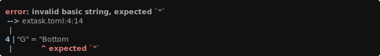
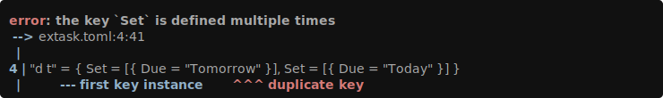
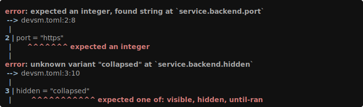

# toml-spanner

High-performance, fast compiling, TOML serialization and deserialization library for rust with full compliance with the TOML 1.1 spec.

[](https://crates.io/crates/toml-spanner)
[](https://docs.rs/toml-spanner/latest/toml_spanner/)
[](LICENSE-MIT)

toml-spanner is a complete TOML libary featuring:

- High Performance: [See Benchmarks](#Benchmarks)
- Fast (Increment & Clean) Complilation: [See Compile Time Benchmarks](https://github.com/exrok/rust-serialization-build-time-benchmarks/blob/main/README.md)
- Compact Span Preserving Tree: See Item on docs.rs
- Derive macros: optional, powerful, zero-dependency <!-- TODO add docs.rs link -->
- Format Preserving Serialization, even through mutation on your own data types.
- Full TOML 1.1, including date-time support, passing 100% of offical TOML test-suite
- Tiny Binary Size <!-- TODO add link to benchmarks once I post them -->
- Extensively tested with miri and fuzzing under memory santizers and debug assertions.
- High quality error messages: [See Examples](#Error-Examples)

## Example

Suppose you have some TOML document declared in `TOML_DOCUMENT` as a `&str`:

```toml
enabled = false
number = 37

[[nested]]
number = 43

[[nested]]
enabled = true
number = 12
```

Then you can parse the TOML document into an `Item` tree, with the following:

```rust
use toml_spanner::{Arena, Context, Deserialize, Failed, Item, Value};

let arena = Arena::new();
let mut root = toml_spanner::parse(TOML_DOCUMENT, &arena).unwrap();
```

You can traverse the tree and inspect values:

```rust
assert_eq!(root["nested"][1]["enabled"].as_bool(), Some(true));

match root["nested"].value() {
    Some(Value::Array(array)) => assert_eq!(array.len(), 2),
    Some(other) => panic!("Expected Array but found: {:#?}", other),
    None => panic!("Expected value but found nothing"),
}
```

When the `deserialize` feature is enabled, toml-spanner provides a set of
helpers and a trait to aid in deserializing `Item` trees into user defined types.

```rust
use toml_spanner::{Arena, Context, Deserialize, Failed, Item};

#[derive(Debug)]
struct Config {
    enabled: bool,
    nested: Vec<Config>,
    number: u32,
}

impl<'de> Deserialize<'de> for Config {
    fn deserialize(ctx: &mut Context<'de>, item: &Item<'de>) -> Result<Self, Failed> {
        let mut th = item.table_helper(ctx)?;
        let config = Config {
            enabled: th.optional("enabled").unwrap_or(false),
            number: th.required("number")?,
            nested: th.optional("nested").unwrap_or_default(),
        };
        th.expect_empty()?;
        Ok(config)
    }
}

if let Ok(config) = root.deserialize::<Config>() {
    println!("parsed: {:?}", config);
} else {
    println!("Deserialization Failure");
    for error in root.errors() {
        println!("error: {}", error);
    }
}
```

Please consult the [API documentation](https://docs.rs/toml-spanner/latest/toml_spanner/) for more details.

## Benchmarks

Measured on AMD Ryzen 9 5950X, 64GB RAM, Linux 6.18, rustc 1.93.0.
Relative parse time across real-world TOML files (lower is better):


Crate Versions: `toml-spanner = 0.4.0`, `toml = 1.0.3+spec-1.1.0`, `toml-span = 0.7.0`

```
                  time(μs)  cycles(K)   instr(K)  branch(K)
zed/Cargo.toml
  toml-spanner        24.6        116        439         91
  toml               255.4       1212       3088        608
  toml-span          389.3       1821       5049       1047
extask.toml
  toml-spanner         8.8         41        149         28
  toml                78.8        372       1005        192
  toml-span          105.1        492       1337        264
devsm.toml
  toml-spanner         3.7         17         69         14
  toml                32.6        155        424         81
  toml-span           56.8        266        711        141
```

This runtime benchmark is pretty simple and focuses just on the parsing step. In practice,
if you also deserialize into your own data types (where toml-spanner has only made marginal
improvements), the total runtime improvement is less, but it is highly dependent on the content
and target data types. Switching devsm from `toml-span` to `toml-spanner` saw a total 8x reduction
in runtime measured from the actual application when including both parsing and deserialization.

### Deserialization and Parsing

Usually, you don't just parse TOML, `toml-spanner` provides helpers to make deserialization easier.
The following benchmarks have taken the exact data structures and deserialization code (originally
using toml and serde), and added support for `toml-spanner` and `toml-span` based parsing and
deserialization. (I haven't added `toml-span` support for Cargo.toml due to its complexity.)


Crate Versions: `toml-spanner = 0.4.1`, `toml = 1.0.3+spec-1.1.0`, `toml-span = 0.7.0`

Commit `3ca292befbc3585084922c1592ea3d17e423f035` was used from `rust-lang/cargo` as reference.

```
                  time(μs)  cycles(K)   instr(K)  branch(K)
zed/Cargo.lock
  toml-spanner      1023.5       4879      16137       3517
  toml              2975.4      14152      36063       7554
  toml-span         5806.3      27182      74738      15478
zed/Cargo.toml
  toml-spanner        92.4        432       1411        286
  toml               333.4       1567       3726        726
```

### Compile Time

Extra `cargo build --release` time for binaries using the respective crates (lower is better):


```
                 median(ms)    added(ms)
null                    108
toml-spanner            739         +631
toml-span              1378        +1270
toml                   3060        +2952
toml+serde             5156        +5048
```

Check out `./benchmark` for more details, but numbers should simulate the additional
time added users would experience during source based installs such as via `cargo install`.

## Divergence from `toml-span`

While `toml-spanner` started as a fork of `toml-span`, it has since undergone
extensive changes:

- 10x faster than `toml-span`, and 5-8x faster than `toml` across
  real-world workloads.
- Preserved index order: tables retain their insertion order by default,
  unlike `toml_span` and the default mode of `toml`.
- Compact `Value` type (on 64bit platforms):

  | Crate                 | Value/Item | TableEntry |
  | --------------------- | ---------- | ---------- |
  | **toml-spanner**      | 24 bytes   | 48 bytes   |
  | toml-span             | 48 bytes   | 88 bytes   |
  | toml                  | 32 bytes   | 56 bytes   |
  | toml (preserve_order) | 80 bytes   | 104 bytes  |

  Note that the `toml` crate `Value` type doesn't contain any span information
  and that `toml-span` doesn't support table entry order preservation.

### Error Examples

Toml-spanner provides specific errors with spans pointing directly to the problem, multi-error accumulation,
and integrations with [annotate-snippets](https://crates.io/crates/annotate-snippets)
and [codespan-reporting](https://crates.io/crates/codespan-reporting).

Here are some parsing examples using the annotated-snippets feature:





Here are some a deserialization error, note how multiple errors are reported instead
bailing out after first error.



### Trade-offs

`toml-spanner` makes extensive use of `unsafe` code to achieve its performance
and size goals. This is mitigated by fuzzing and running the test suite under
Miri.

### Testing

The `unsafe` in this crate demands thorough testing. The full suite includes
[Miri](https://github.com/rust-lang/miri) for detecting undefined behavior,
fuzzing against the reference `toml` crate, and snapshot-based integration
tests.

```bash
cargo test --workspace                          # all tests
cargo test -p snapshot-tests                       # integration tests only
cargo +nightly miri nextest run                 # undefined behavior checks
cargo +nightly fuzz run parse_compare_toml      # fuzz against the toml crate
cargo +nightly fuzz run parse_value             # fuzz the parser directly

# Test 32bit support under MIRI
cargo +nightly miri nextest run -p toml-spanner --target i686-unknown-linux-gnu
```

Integration tests use [insta](https://insta.rs/) for snapshot assertions.
Run `cargo insta test -p snapshot-tests` and `cargo insta review` to review
changes.

Code coverage:

```bash
cargo +nightly llvm-cov --branch --show-missing-lines -- -q
```

Note: See the `devsm.toml` file in the root for typical commands that are run during development.

### Acknowledgements

toml-spanner started off as fork of toml-span and though it's been completely rewritten at this
point, the original test suite and some of the API patterns remain.

Both toml and toml-edit crates

Unlike the original, `toml-spanner` aims to be a fully compliant TOML v1.1.0 parser, including
full date-time support, with conformance verified by extensive fuzzing against the `toml` crate
and passing the official TOML decoding test suite.

### License

This contribution is dual licensed under EITHER OF

- Apache License, Version 2.0, ([LICENSE-APACHE](LICENSE-APACHE) or <http://www.apache.org/licenses/LICENSE-2.0>)
- MIT license ([LICENSE-MIT](LICENSE-MIT) or <http://opensource.org/licenses/MIT>)

at your option.
